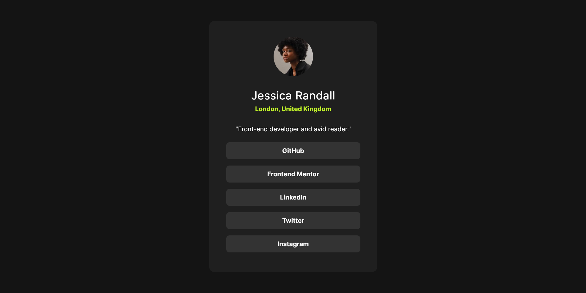

# Frontend Mentor - Social links profile solution

This is a solution to the [Social links profile challenge on Frontend Mentor](https://www.frontendmentor.io/challenges/social-links-profile-UG32l9m6dQ). Frontend Mentor challenges help you improve your coding skills by building realistic projects.

## Table of contents

- [Overview](#overview)
  - [The challenge](#the-challenge)
  - [Screenshot](#screenshot)
  - [Links](#links)
- [My process](#my-process)
  - [Built with](#built-with)
  - [What I learned](#what-i-learned)
- [Author](#author)

**Note: Delete this note and update the table of contents based on what sections you keep.**

## Overview

### The challenge

Users should be able to:

- See hover and focus states for all interactive elements on the page

### Screenshot



### Links

- Solution URL: [Github code link](https://github.com/Conquerant2135/social_media_link/)
- Live Site URL: [Github page link](https://conquerant2135.github.io/social_media_link/)

## My process

### Built with

- Semantic HTML5 markup
- CSS custom properties
- Flexbox
- CSS Grid

### What I learned

I learned the usage of the @media query here , i can set special properties for each screen size

```css
@media (max-width: 412px) {
  .card {
    width: 315px;
    padding-top: 14px;
    padding-bottom: 28px;
  }

  .descr {
    font-size: 14px;
  }
}
```

### Continued development

I still want to focus more on responsive development

### Useful resources

## Author

- Frontend Mentor - [@Conquerant2135](https://www.frontendmentor.io/profile/Conquerant2135)
